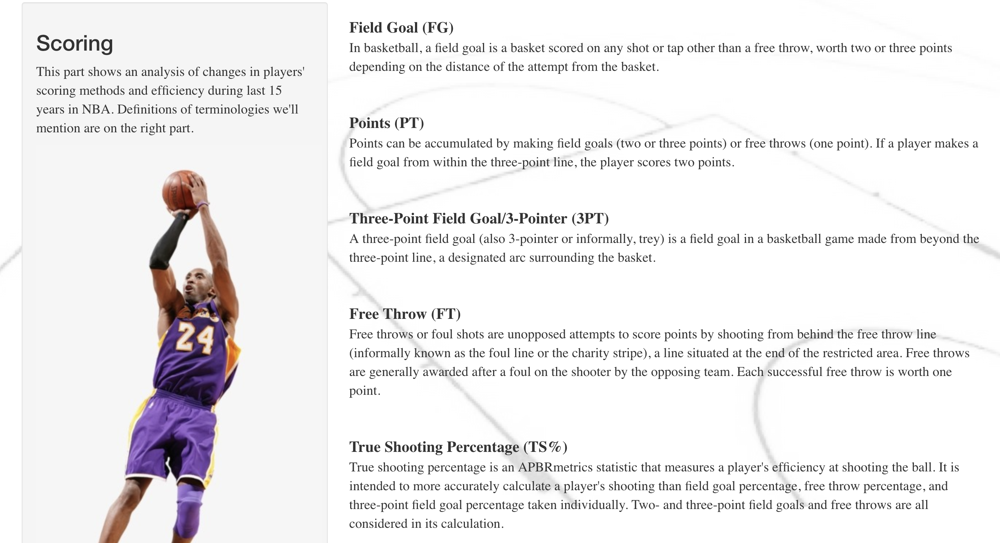
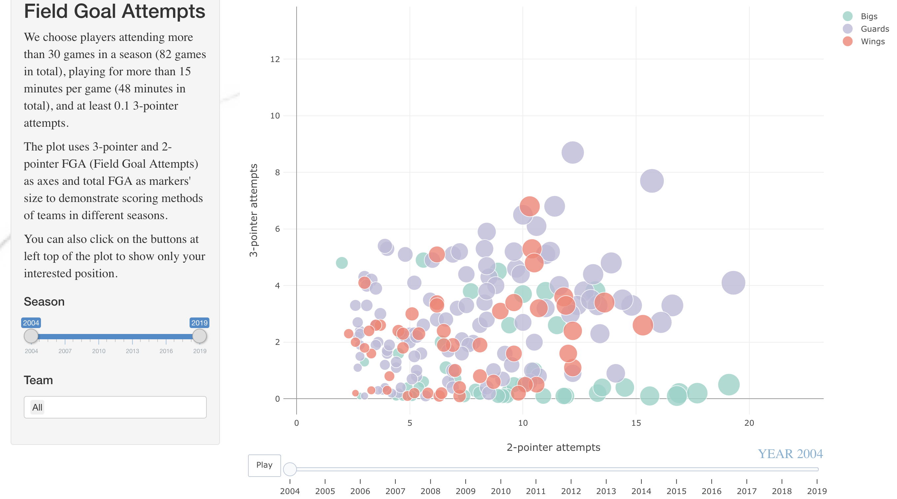
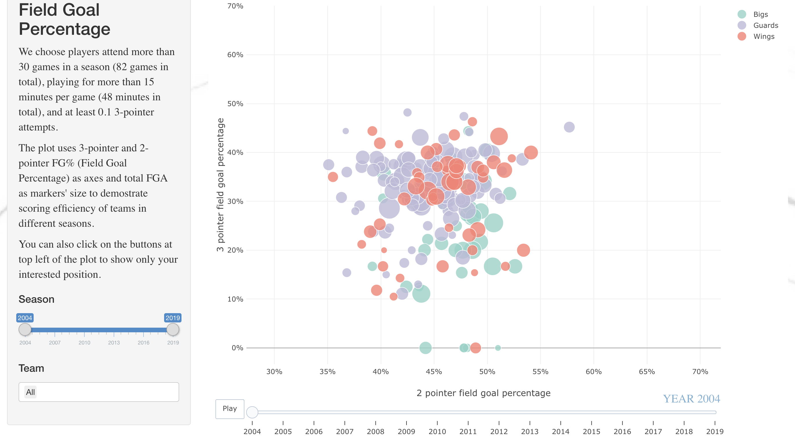
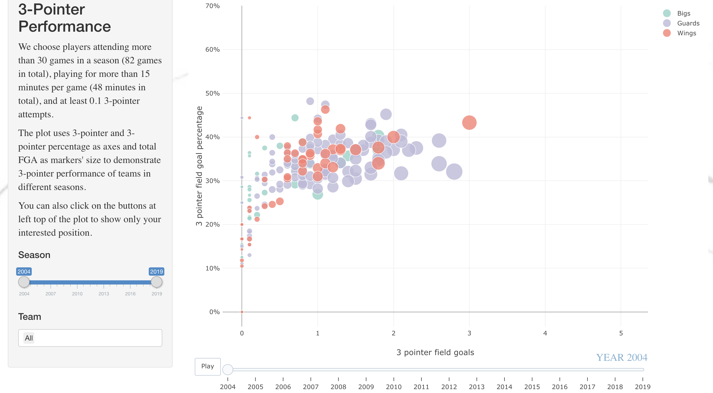
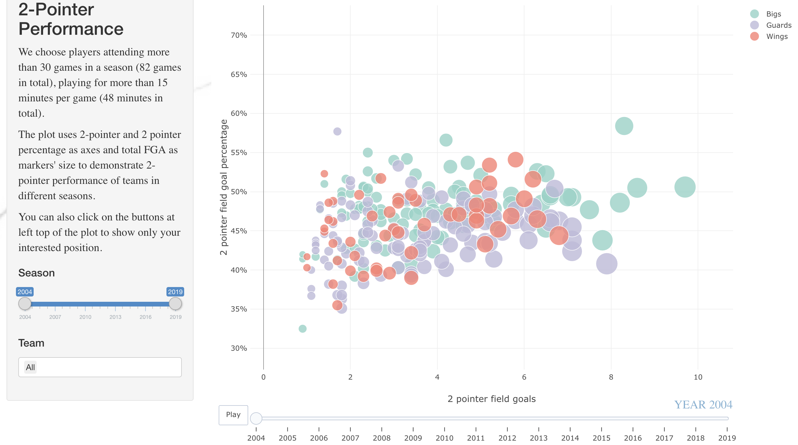

```{r message=FALSE, warning=FALSE, echo=FALSE}
library(tidyverse)
library(ggridges)
library(gridExtra)
library(plotly)
library(extracat)
library(summarytools)
st_options(
  bootstrap.css = FALSE,
  plain.ascii = FALSE,
  style = "rmarkdown",
  dfSummary.silent = TRUE,
  footnote = NA,
  subtitle.emphasis = FALSE
)
library(knitr)
opts_chunk$set(comment = NA,prompt = FALSE,cache = FALSE,results = "asis")
library(skimr)
```

```{r echo=FALSE, out.width = '100%',fig.align="center"}

# Source: https://www.skinit.com/nba-all-star
```


## I. Introduction
***

The National Basketball Association(NBA) is a men's professional basketball league in North America composed of 30 teams. With David Stern's(the fourth NBA Commissioner) great efforts, NBA turns into the sport of the modern world from an unknown commodity outside the United States. Besides its business modes and fame, NBA's games are going through great revolutions during the last 15 years. ^[1](https://web.archive.org/web/20150630155528/http://www.usab.com/about/inside-usa-basketball/members.aspx)^ ^[2](https://en.wikipedia.org/wiki/National_Basketball_Association)^

Today we are able to analyze the teams' and players' performance from different angles using their gaming data instead of simply watching video records, which provides us more ways to learn and enjoy the basketball games.

In this report, we are going to use data to find out how NBA changes for the past 15 years. We are curious about how the overall strategy of teams changes as well as how players adapt to these changes.

<br><br>

## II. Data source
***

### Collection

_Chao Yin_ is mainly responsible for collecting team/player game stats data while _Zeyu Yang_ is responsible for players' biographical information.

Our data is collected from [Basketball-Reference](https://www.basketball-reference.com/) and [Stats NBA](https://stats.nba.com/).

* *Basketball Reference* is a site providing both basic and sabermetric statistics and resources for basketball fans using official NBA data. 

* *Stats NBA* is the home of NBA Advanced Stats and provides  official NBA Statistics and advanced analytics. 


Data in Basketball-Reference is stored in XML so that we can directly extract them using packages `XML` and `RCurl`. However, some tables on this site are commented and they can only be downloaded manually in CSV form thus we choose Stats NBA for other data. It's a bit harder to extract data tables from Stats NBA than from Basketball-Reference since they are stored in JSON files. We use `statsnbaR` which provides utility functions to download data from the API end-points of Stats NBA. We got `teams` from Basketball -Reference and `players` from Stats NBA.


### Datasets and variables

`players` datasets contain all regular season information of all players in one season. 

<br>
General data provides basic players' performance including:

* Profile information: Name, Team, Age, Game Played, Minutes Played, etc.

* Shooting performance from 2 pointer, 3 pointer, and free throw:  Field Goals Made, Field Goals Attempted, Field Goal Percentage, etc.

* Basic stats per game: Rebounds, Assists, Steals, Blocks, Points, Turnovers, Personal Fouls, etc.

<br>
Advanced data measures and analyzes players' abilities in one specific area:

* Overall ratings: Offensive Rating, Defensive Rating, Net Rating, Player Impact Estimate, Usage Percentage, etc.

* Passing/Assist ability: Assist Percentage, Assist to Turnover Ratio, Assist Ratio

* Rebound ability: Offensive Rebound Percentage, Defensive Rebound Percentage, Rebound Percentage

* Shooting ability: Effective Field Goal Percentage, True Shooting Percentage

<br>
Bio dataset contains players' biographical data:

* The year player starts playing at NBA and the year he retires

* Height and weight data

* Birthdate

* College attended

<br>

`teams` datasets contain similar information as shown in the `players` but corresponds to each team in the league. However, `teams` provides ways to split the data in order to measure the teams' performance from different angles:

* *Location* helps measure teams' gaming performance at home or on the road respectively

* *Wins-Losses* tells how the team played when they won or lost the game

* *Month* and *Pre/Post All Stars* give teams' performance changes over time periods

* *Days Rest* tests teams' abilities to handle tough schedules 

### Issues/Problems

+ Teams in NBA keep changing in these 15 years. Three teams change their team locations and team names thus we may find the teams are not necessarily the same each year. 

+ Players can be traded and signed during the season, which makes some players have more records than others in these datasets.

+ Height data in `bio` dataset is saved as character, such as "6-8", which requires us to convert them to numeric.

+ All data are saved as factor, which requires us to convert them to numeric or character.

<br><br>

## III. Data cleaning
***

```{r, echo=FALSE}
load('../data/tidy/Player.RData')
load('../data/tidy/Players_bio.RData')
load('../data/tidy/Team_splits.RData')
load('../data/tidy/Team_shooting.RData')
```

After we got all the raw data in **[data/raw](https://github.com/c-yin/GR5293-finalproj-group10/tree/master/data/raw)**, we wanted to combine them into four datasets: `Team_splits`, `Team_shoots`, `Player` & `Players_bio`, which are stored in **[data/tidy](https://github.com/c-yin/GR5293-finalproj-group10/tree/master/data/tidy)**.

For the players' data, we first remove empty rows and columns and turn the variables into numerics and characters according to their content. Considering more and more players can play more than one position today, we group the players into three kinds: Guards, Wings, and Bigs instead of the origin positions they play. And finally, we combined players data of all 15 years and got `Player`.

_* Scroll down the table to see more details_
```{r warning=FALSE,message=FALSE}
print(dfSummary(Player,
                headings = FALSE,
                plain.ascii = FALSE,
                valid.col = FALSE,
                graph.magnif = 0.75,
                style = "grid",
                max.distinct.values = 5,
                varnumbers = FALSE),
      max.tbl.height = 500,method='render')
```

For `Players_bio` data, we join players' data and biographical data and turn the variables into numerics and characters according to their content. 

_* Scroll down the table to see more details_
```{r warning=FALSE,message=FALSE}
print(dfSummary(Players_bio,
                headings = FALSE,
                plain.ascii = FALSE,
                valid.col = FALSE,
                graph.magnif = 0.75,
                style = "grid",
                max.distinct.values = 5,
                varnumbers = FALSE),
      max.tbl.height = 500,method='render')
```


For teams' data, we split them into two datasets `Team_split` and `Team_shooting`.

`Teams_splits` contains all the 'per game' stats for each 30 team every season. We choose 'Location' to filter because all the teams have to play 41 Home game and 41 Road games every year and we simply calculate the mean to get seasonal average stats. We changed the format, removed the ranking variables, combined the basic with advanced data, and put all 15 years data into this one dataset.

_* Scroll down the table to see more details_
```{r warning=FALSE,message=FALSE}
print(dfSummary(Team_splits,
                headings = FALSE,
                plain.ascii = FALSE,
                valid.col = FALSE,
                graph.magnif = 0.75,
                style = "grid",
                max.distinct.values = 5,
                varnumbers = FALSE),
      max.tbl.height = 500,method='render')
```

`Team_shooting` contains all the shooting performance of each team from different regions on the court. We cleaned them the same way as `Team_splits`.

_* Scroll down the table to see more details_
```{r warning=FALSE,message=FALSE}
print(dfSummary(Team_shooting,
                headings = FALSE,
                plain.ascii = FALSE,
                valid.col = FALSE,
                graph.magnif = 0.75,
                style = "grid",
                max.distinct.values = 5,
                varnumbers = FALSE),
      max.tbl.height = 500,method='render')
```


_* To understand the meaning of all variables, please visit [StatsNBA](https://stats.nba.com/help/glossary/)._

<br><br>

## IV. Missing values
***

As we can see in the aforementioned tables, there is no missing value in `Teams_splits` and `Team_shooting`. Also, since `Player` and `Players_bio` are similar to each other, we are going to display the missing values of `Players_bio` here.

```{r fig.align="center",fig.cap="Figure: Missing values"}
visna(Players_bio)
```
The first row in the above figure shows that the marjority of the data has no missing values.

Those rows that have missed *year_start* variable also missed all the following variables. This is because these columns come from another table: bio. Although the bio table itself has no missing values, it does not contain all the players as `Player` data has.

Also, we can see that there are quite some rows missing _3PA_ values, _FT_ values, etc. These variables are related to players' shooting data per season. The missing values mean that these players do not shoot that season.

<br><br>

## V. Results
***

### Age
```{r message=FALSE,error=FALSE,warning=FALSE,fig.align="center"}
data <- Players_bio%>%
  filter(Year>=2004)%>%
  select(Player,Age,Year)%>%
  distinct()%>%
  as.data.frame(stringsAsFactors = F)%>%
  select(Age,Year)
# ggplot(data,aes(x=as.factor(Year),y=Age))+geom_boxplot()

ggplot(data, aes(x=Age, y=Year,group=Year)) +
  stat_density_ridges(quantile_lines = TRUE, quantiles = 2, fill="grey80") +
  geom_text(data=data %>% group_by(Year) %>% 
              summarise(Age=median(Age)),
            aes(label=sprintf("%1.1f", Age)), 
            position=position_nudge(y=-0.1), colour="#17408B", size=3)+
  geom_text(data=data %>% group_by(Year) %>% 
              summarise(Age=min(Age)),
            aes(label=sprintf("%1.1f", Age)), 
            position=position_nudge(y=-0.1), colour="#17408B", size=3)+
  geom_text(data=data %>% group_by(Year) %>% 
              summarise(Age=max(Age)),
            aes(label=sprintf("%1.1f", Age)), 
            position=position_nudge(y=-0.1), colour="#17408B", size=3)+
  xlab("")+
  ylab("")+
  ggtitle("Age Distribution")+
  scale_y_continuous(breaks=seq(2004,2019))+
  scale_x_continuous(breaks=seq(15,45,3))+
  theme_minimal()+
  theme(
    plot.title = element_text(size=17.5,face="bold"),
    axis.text.x = element_text(color = "#000000", size = 11),
    axis.text.y = element_text(color = "#000000", size = 11))
```

The ridge plot presents the distribution of the NBA players' age by year. The x-axis is the age, the y-axis is the year, the height of each line is the probability of this particular age.

The three numbers on each distribution are min age, median age and max age(from left to right) of that season.

As we can see from the plot, the distribution of age has not changed greatly--the majority ages of players are around 20-35. The median age changes slightly from 26 to 25.

We can also notice that there is a jump in the minimum age between 2006 and 2007. The minimum age before 2006 is 18 while the minimum age after 2006 is 19. This is because, in 2006, the NBA had increased the draft-eligible age from 18 to 19. 

Another noticeable point is the maximum age. It has several increases and decreases. Every increase is mainly caused by one player. Take the increase from 2015 to 2019 as an example, the eldest player is Vince Carter. He is almost the eldest player in NBA history. The reason why these players are still playing is due to multiple reasons: they are still active players, they are not suffered from serious injuries, etc.

<br>

### Height/Weight Ratio
```{r fig.align="center"}
data <- Players_bio%>%
  filter(Year>=2004)%>%
  select(Player,height,weight,Year)%>%
  distinct()%>%
  drop_na()%>%
  as.data.frame(stringsAsFactors = F)%>%
  select(height,weight,Year)%>%
  dplyr::group_by(Year)%>%
  dplyr::summarise(avg_h=mean(height),avg_w=mean(weight))%>%
  dplyr::ungroup()%>%
  mutate(hw_ratio=avg_h/avg_w)%>%
  select(Year,hw_ratio)


ggplot()+
  geom_line(aes(x=Year,y=hw_ratio),data=data,color="#C9082A",size=2)+
  geom_point(aes(x=Year,y=hw_ratio),data=data,color="#C9082A",size=4)+
  geom_point(aes(x=Year,y=hw_ratio),data=data,color="white",size=2)+
  scale_x_continuous(breaks=seq(2004,2019))+
  #scale_y_continuous(labels = scales::percent_format(accuracy = 1))+
  #scale_y_continuous(labels = function(x) {paste0(round(x,3)*100, "%")})+
  scale_y_continuous(labels = c("90.0%","90.5%","91.0%","91.5%","92.0%"), breaks = c(0.9,0.905,0.91,0.915,0.92))+
  xlab('') +
  ylab('') +
  theme_minimal()+
  ggtitle("Average Height/Weight Ratio Per Season")+
  theme(plot.title = element_text(size=17.5,face="bold"),
        axis.text.x = element_text(angle = 45, hjust = 1,color = "#000000", size = 11),
        axis.text.y = element_text(color = "#000000", size = 11))
```

This plot presents the average height/weight ratio of the players. It reflects players' body shape. There is a clear increasing trend of this ratio after 2011.

While the average height and average weight have not changed much for past 15 years(as we can see in the following table), the increase of the height/weight ratio means the weight is relatively decreasing compared with the height, which suggests the players are becoming more and more facile and fast.
```{r}
data <- Players_bio%>%
  filter(Year>=2004)%>%
  select(Player,height,weight,Year)%>%
  distinct()%>%
  drop_na()%>%
  as.data.frame(stringsAsFactors = F)%>%
  select(height,weight,Year)%>%
  dplyr::group_by(Year)%>%
  dplyr::summarise(avg_h=round(mean(height),1),avg_w=round(mean(weight),1))%>%
  dplyr::ungroup()%>%
  column_to_rownames(var="Year")%>%
  t()%>%
  as.data.frame(stringsAsFactors = FALSE)
pander(data)
```

_* The first row is the average height data(cm), the second row is the average weight data(pound)._

<br>

### Overall Offensive Performance

```{r fig.align="center"}
Team_splits %>% select(year, pts, pace) %>% group_by(year) %>% summarise(Pace = mean(pace), Points = mean(pts)) %>%
  gather(key = 'type', value = 'value', -year) %>%
  ggplot(aes(x = year, y = value)) +
  geom_line(color = '#C9082A', size = 2) +
  geom_point(color = '#C9082A', size = 4) +
  geom_point(color = '#FFFFFF', size = 2) +
  #scale_color_manual(values = c('#17408B', '#C9082A')) +
  facet_grid(type ~ ., scales = 'free_y') +
  scale_x_continuous(labels = unique(Team_splits$year), breaks = unique(Team_splits$year)) +
  xlab('') +
  ylab('') +
  ggtitle('Pace and Points Per Game') +
  theme_minimal() +
  theme(axis.text.x = element_text(angle = 45, vjust = 0.5,color = "#000000", size = 11), 
        axis.text.y = element_text(color = "#000000", size = 11), 
        strip.text.y = element_text(size = 10, colour = '#FFFFFF', face = 'bold'),
        strip.background = element_rect(fill = '#17408B', colour = 'white'),
        plot.title = element_text(size = 17.5, face = 'bold'),
        legend.position = 'none')
```


There 's an obvious trend in both **Pace** (the number of possessions a team uses per game) and **PPG** (Points Per Game) of NBA games in recent 15 years. The more possessions a team accumulates, the quicker the pace of the game.

We can see that from 2004 to 2013 the pace and PPG are fluctuating around 93 and 98 respectively, but from 2014 these two stats keep growing and especially in 2019 the pace rise to 101 from 98 last year and PPG increases by nearly 6 points more than last season. It's easy to find a positive association between pace and PPG since the more possessions you have the more chances you can score, though also gives their opponents more chances.


_* The formula for pace is: ((Tm Poss + Opp Poss) / (2 x (Tm MP / 5))). The first part of the equation sums Team Possessions and Opponent's Possessions. The latter half of the equation uses Team Minutes Played, which is the total number of minutes played by each player on the team._  [StatNBA](-- https://www.sportingcharts.com/dictionary/nba/pace-factor.aspx)


```{r, message=FALSE,fig.align="center"}
Team_splits %>% select(year, ortg, pctWins) %>% group_by(year) %>%
  ggplot(aes(x = year, y=ortg, alpha = pctWins, color = pctWins)) +
  geom_jitter(size = 2) +
  scale_colour_gradient(low = "#8ec5ff", high = "#19293a",breaks
=c(0.2,0.4,0.6,0.8), labels=c("20%","40%","60%","80%"))+
  geom_smooth(linetype = 'longdash', colour = '#C9082A', se = FALSE, size = 2, show.legend = F) +
  scale_x_continuous(labels = unique(Team_splits$year), breaks = unique(Team_splits$year)) +
  guides(alpha=FALSE)+
  ggtitle('Average Offensive Rating Per Game') +
  xlab('') +
  ylab('') +
  labs(colour="% Win")+
  theme_minimal() +
  theme(axis.text.x = element_text(angle = 45, vjust = 0.5,color = "#000000", size = 11),
        axis.text.y = element_text(color = "#000000", size = 11),
        plot.title = element_text(size = 17.5, face = 'bold')) 
```

This plot shows average **offrtg** (offensive rating, a statistic used to measure a team's offensive performance) of each team in these 15 years. The color reflects the Win Percentage of each team. The darker the marker is, the more the team wins. 

The dashed line is the fitted line of the data. It seems that teams with a higher offensive rating(points above the dashed line) tend to have a higher Win Percentage(Darker points).

Offensive Rating shows that the offensive ability of each team started growing from 2013 and reached an unprecedented level in 2018. We are curious about is there any other reasons for such high offensive performance these years except the high pace?

_* offrtg = 100x((Points)/(POSS). It measures a team's points scored per 100 possessions. On a player level, this statistic is team points scored per 100 possessions while he is on court._  [StatNBA](-- https://www.sportingcharts.com/dictionary/nba/pace-factor.aspx)

<br>

### Scoring 

```{r, fig.width=15, fig.height=7,fig.align="center"}
p1 <- Team_splits %>% select(year, fg3a, fg2a) %>%
  gather(key = 'type', value = 'attempt', -c(year)) %>%
  group_by(year, type) %>% summarise(attempt = mean(attempt)) %>%
  ggplot(aes(x = year, y = attempt, group = year)) +
  #geom_boxplot(aes(color = type)) +
  #geom_line() +
  geom_bar(stat = 'identity', fill = '#C9082A') +
  facet_grid(type ~., scales = 'free_y', labeller = as_labeller(c(`fg2a` = '2 pointer', `fg3a` = '3 pointer'))) +
  scale_color_manual(values = c('#17408B', '#C9082A')) +
  scale_x_continuous(labels = unique(Team_splits$year), breaks = unique(Team_splits$year)) +
  xlab('') +
  ylab('') +
  #ylim(0, 2500) +
  ggtitle('Field Goals Attempt') +
  theme_minimal() +
  theme(axis.text.x = element_text(angle = 60, vjust = 0.5,color = "#000000", size = 15),
        axis.text.y = element_text(color = "#000000", size = 15),
        strip.text.y = element_text(size = 15, colour = '#FFFFFF', face = 'bold'),
        strip.background = element_rect(fill = '#17408B', colour = 'white'),
        plot.title = element_text(size = 17.5, face = 'bold'),
        legend.position = 'none') 

p2 <- Team_splits %>% select(year, pctFG3, pctFG2) %>% 
  gather(key = 'type', value = 'percentage', -c(year)) %>%
  group_by(year, type) %>% summarise(percentage = mean(percentage)) %>%
  ggplot(aes(x = year, y = percentage)) +
  geom_line(color = '#C9082A', size = 2) +
  geom_point(color = '#C9082A', size = 4) +
  geom_point(color = '#FFFFFF', size = 2) +
  facet_grid(type ~., scales = 'free_y', labeller = as_labeller(c(`pctFG2` = '2 pointer', `pctFG3` = '3 pointer'))) +
  scale_x_continuous(labels = unique(Team_splits$year), breaks = unique(Team_splits$year)) +
  #scale_y_continuous(labels = scales::percent_format(accuracy = 1))+
  scale_y_continuous(labels = function(x) {paste0(round(x,3)*100, "%")})+
  xlab('') +
  ylab('') +
  ggtitle('Field Goals Percentage') +
  theme_minimal() + 
  theme(axis.text.x = element_text(angle = 60, vjust = 0.5,color = "#000000", size = 15),
        axis.text.y = element_text(color = "#000000", size = 15),
        strip.text.y = element_text(size = 15, colour = '#FFFFFF', face = 'bold'),
        strip.background = element_rect(fill = '#17408B', colour = 'white'),
        plot.title = element_text(size = 17.5, face = 'bold'))

grid.arrange(p1, p2, ncol = 2)
```

In basketball, a **field goal** is a basket scored on any shot or tap other than a free throw, worth two or three points depending on the distance of the attempt from the basket. An **attempt** is counted no matter this shot is scored.

This plot shows the **FGA** (Field Goal Attempt) and **FG%** (Field Goal Percentage) for both 2 pointer and 3 pointer of the league average performance(per team per game). Please note that the FG% only relates to the scored shots -- they are the percentage of scored shots over all the attempts. The sum of 3 pointer FG% and 2 pointer FG% does not necessarily add up to 100%. 

In the left plot, we find that teams are attempting more and more 3 pointer year by year without decreasing too much 2 pointer attempts. In 2019, FGA for 3 is more than twice of that 15 years ago. Also in 2019, FGA for 3 is beyond 30 and FGA for 2 is below 60, which means in average every three shots in an NBA game there is one 3 pointer shot in 2019. 

The right plot tells the FG% of 2 pointer and 3 pointer from 2004 to 2019. It's clear that the FG% for 2 keeps growing from 2012 and reached beyond 50% since 2017. The FG% for 3 is fluctuating between 35% and 36% in most years. We can see that teams are trying to make 2 pointer shots more efficient by increasing the FG% of it.

__From these two plots, we can see that the strategy of NBA teams to score more is to try more 3 pointer and keep 2 pointer shots more efficient.__

```{r, fig.width=15, fig.height=10,fig.align="center"}
Team_shooting$distance <- factor(Team_shooting$distance, levels = unique(Team_shooting$distance))

p1 <- Team_shooting %>% filter(distance != 'Back Court Shot') %>% select(distance, fga, year) %>% group_by(year, distance) %>% summarise_all(mean) %>%
  ggplot(aes(x = year, y = fga/82, group = year)) +
  #geom_boxplot() +
  geom_bar(stat = 'identity', fill = '#C9082A') +
  facet_grid(distance ~ ., scales = 'free_y') +
  scale_x_continuous(labels = unique(Team_splits$year), breaks = unique(Team_splits$year)) +
  xlab('') +
  ylab('') +
  #ylim(0,1500) +
  ggtitle('Field Goals Attempt by Distance') +
  theme_minimal() +
    theme(axis.text.x = element_text(angle = 45, vjust = 0.5,color = "#000000", size = 15), 
          axis.text.y = element_text(color = "#000000", size = 15),
          legend.position = 'none',
          strip.text.y = element_text(size = 15, colour = '#FFFFFF', face = 'bold'),
          strip.background = element_rect(fill = '#17408B', colour = 'white'),
          plot.title = element_text(size = 17.5, face = 'bold'))

p2 <- Team_shooting %>% filter(distance != 'Back Court Shot') %>% select(distance, pctFG, year) %>% group_by(year, distance) %>% summarise_all(mean) %>%
  ggplot(aes(x = year, y = pctFG)) +
  geom_line(color = '#C9082A', size = 2) +
  geom_point(color = '#C9082A', size = 4) +
  geom_point(color = '#FFFFFF', size = 2) +
  facet_grid(distance ~ ., scales = 'free_y') +
  scale_x_continuous(labels = unique(Team_splits$year), breaks = unique(Team_splits$year)) +
  #scale_y_continuous(labels = scales::percent_format(accuracy = 1))+
  scale_y_continuous(labels = function(x) {paste0(round(x,3)*100, "%")})+
  xlab('') +
  ylab('') +
  ggtitle('Field Goals Percentage by Distance') +
  theme_minimal() +
  theme(axis.text.x = element_text(angle = 45, vjust = 0.5,color = "#000000", size = 15), 
        axis.text.y = element_text(color = "#000000", size = 15),
        legend.position = 'none',
        strip.text.y = element_text(size = 15, colour = '#FFFFFF', face = 'bold'),
        strip.background = element_rect(fill = '#17408B', colour = 'white'),
        plot.title = element_text(size = 17.5, face = 'bold'))

grid.arrange(p1, p2, ncol = 2)
```

This plot shows FGA and FG% of shots from different regions on the court. The distance is how far the shooting spot is from the basket. 

Shots beyond 23 feet 9 inches from the basket is 3 pointer and others are 2 pointer. The 24+ ft data are similar to that of the 3 pointer in the plot above. The 2 pointer shots can be decomposed into 3 types -- 'near basket'(Less than 8 ft.), 'mid-range'(8-16 ft.), 'long-range'(16-24 ft.). 
 
We can see from the left plot that 'near basket' 2 pointer FGA is the most among all and it reaches 30 in 2019 which is even more than the sum of the other two types. While 'long-range' shots keeps going down and 'mid-range' remains around 12. Considering the difficulty of making a field goal rises with the distance from the basket, 'long-range' shots seem to be less valuable than 'near basket' ones. In the right plot, we can see 'near basket' shots' FG% goes far beyond others and reached 58% in 2019 while 'mid-range' shots' FG% also keeps rising.

__NBA teams keep throwing more 3 pointer and in the meanwhile raise the FG% of 2 pointer. They decrease the attempts to shoot from 'low efficiency' regions and focus more near the basket.__

```{r, message=FALSE,fig.align="center"}
Team_splits %>% select(year, pctTS, pctWins) %>% group_by(year) %>%
  ggplot(aes(x = year, y=pctTS, alpha = pctWins, color = pctWins)) +
  geom_jitter(size = 2) +
  scale_colour_gradient(low = "#8ec5ff", high = "#19293a",breaks
=c(0.2,0.4,0.6,0.8), labels=c("20%","40%","60%","80%"))+
  geom_smooth(linetype = 'longdash', colour = '#C9082A', se = FALSE, size = 2, show.legend = F) +
  theme(axis.text.x = element_text(angle = 45, vjust = 0.5), legend.position = 'none') +
  scale_x_continuous(labels = unique(Team_splits$year), breaks = unique(Team_splits$year)) +
  scale_y_continuous(labels = scales::percent_format(accuracy = 1))+
  ggtitle('Average True Shooting Percentage Per Game') +
  guides(alpha=FALSE)+
  xlab('') +
  ylab('') +
  labs(colour="% Win")+
  theme_minimal() +
  theme(axis.text.x = element_text(angle = 45, vjust = 0.5,color = "#000000", size = 11),
        axis.text.y = element_text(color = "#000000", size = 11),
        plot.title = element_text(size = 17.5, face = 'bold'))
```

**TS%** (True Shooting Percentage, measures efficiency at shooting the ball) synthesizes field goal percentage, free throw percentage, and 3 pointer field goal percentage instead of taking them individually to calculate shooting more accurately. The same as before, the darker the marker is, the more the team wins. 

It's easy to find that the curve of TS% shares the similar shape of that of _offrtg_ curve and teams at present shoots much more efficiently than 15 years ago.

_* TS%=Points/ [2 x (Field Goals Attempted+0.44 x Free Throws Attempted)]. This is a shooting percentage that factors in the value of three-point field goals and free throws in addition to conventional two-point field goals._  [StatNBA](-- https://www.sportingcharts.com/dictionary/nba/pace-factor.aspx)

<br>

### Sharing the ball

Basketball teamwork is in fact very important as it allows the team to function together and not individually. During offensive situations, teamwork is vital because you need to confuse the defense on who will take the shot or where the shot will come from.  If there is only one person making the shot for the team, then the defense will mostly concentrate their efforts in putting a stop to their scorer.

```{r fig.align="center"}
Team_splits %>% select(year, ast, tov) %>% group_by(year) %>% summarise_all(mean) %>%
  gather(key = 'type', value = 'value', -year) %>%
  ggplot(aes(x = year, y=value)) +
  geom_line(color = '#C9082A', size = 2) +
  geom_point(color = '#C9082A', size = 4) +
  geom_point(color = '#FFFFFF', size = 2) +
  scale_x_continuous(labels = unique(Team_splits$year), breaks = unique(Team_splits$year)) +
  ggtitle('Average Assists Per Game') +
  facet_grid(type ~ ., scales = 'free_y') +
  xlab('') +
  ylab('') +
  theme_minimal() +
  theme(axis.text.x = element_text(angle = 45, vjust = 0.5,color = "#000000", size = 11), 
        axis.text.y = element_text(color = "#000000", size = 11),
        legend.position = 'none',
        strip.text.y = element_text(size = 15, colour = '#FFFFFF', face = 'bold'),
        strip.background = element_rect(fill = '#17408B', colour = 'white'),
        plot.title = element_text(size = 17.5, face = 'bold'))
```

**Ast** (Assist, attributed to a player who passes the ball to a teammate in a way that leads to a score by field goal) roughly measures the willingness and ability of a team to share the ball and **tov** (Turnover, occurs when a team loses possession of the ball to the opposing team before a player takes a shot at their team's basket) give a angle to view how disciplined the team is.

In this plot, we can see that the assist rising dramatically in 2013 and since then it keeps growing. While turnover first rises until 2014 and starts to drop till now. It's likely that in 2013 and 2014 teams started to speed up and encourage passing while players didn't get used to this style and a lot of passes turns into turnover. From 2015, teams began to figure out how to pass the ball right to the scorer and reduce bad passes.

```{r, message=FALSE,fig.align="center"}
Team_splits %>% select(year, ratioAST, pctWins) %>% group_by(year) %>%
  ggplot(aes(x = year, y=ratioAST/100, alpha = pctWins, color = pctWins)) +
  geom_jitter(size = 2) +
  scale_colour_gradient(low = "#8ec5ff", high = "#19293a",breaks
=c(0.2,0.4,0.6,0.8), labels=c("20%","40%","60%","80%"))+
  geom_smooth(linetype = 'longdash', colour = '#C9082A', se = FALSE, size = 2, show.legend = F) +
  scale_x_continuous(labels = unique(Team_splits$year), breaks = unique(Team_splits$year)) +
  scale_y_continuous(labels = scales::percent_format(accuracy = 1))+
  guides(alpha=FALSE)+
  ggtitle('Assist Ratio Per Game') +
  xlab('') +
  ylab('') +
  labs(colour="% Win")+
  theme_minimal() +
  theme(axis.text.x = element_text(angle = 45, vjust = 0.5,color = "#000000", size = 11), 
        axis.text.y = element_text(color = "#000000", size = 11),
        #legend.position = 'none',
        plot.title = element_text(size = 17.5, face = 'bold'))
```

Assist Ratio is the percentage of a team's possessions that ends in an assist. The growth is obvious in recent three years and we can see there are teams pretty good at sharing balls these years and they all receive outstanding grades.

_* Assist Ratio=(AST * 100) / (POSS)._  [StatNBA](-- https://www.sportingcharts.com/dictionary/nba/pace-factor.aspx)

<br><br>

## VI. Interactive Plot
***

The following interactive plots are created in a shiny app. The link to our shiny app is https://cy2507.shinyapps.io/NBA_15years/. You may click on the link to play with the interactive components.

### Scoring

This part shows the analysis of changes in players' scoring methods and efficiency during the last 15 years in the NBA. Definitions of terminologies we'll mention are on the right part.

We choose players who attend more than 30 games in a season (82 games in total), play for more than 15 minutes per game (48 minutes in total), and at least 0.1 3-pointer attempts.

You can also click on the buttons at the top left of the plot to show only your interested position.

```{r echo=FALSE, out.width = '80%',fig.align="center",fig.cap="Scoring-Front page"}

```


#### Field Goal Attempts

```{r echo=FALSE, out.width = '80%',fig.align="center"}

```

This plot uses 3-pointer and 2-pointer FGA (Field Goal Attempts) as axes and total FGA as markers' size to demonstrate scoring methods of teams in different seasons.

From the plot, we can see that starting from 2012, there is a noticeable increase trend in 3-pointer FGA.

<br>

#### Field Goal Percentage

```{r echo=FALSE, out.width = '80%',fig.align="center"}

```

The plot uses 3-pointer and 2-pointer FG% (Field Goal Percentage) as axes and total FGA as markers' size to demonstrate the scoring efficiency of teams in different seasons.

We can see that 3-pointer field goal percentage is around the same while the 2-pointer field goal percentage is increasing. The strategy of NBA teams to score more is to keep 2 pointer shots more efficient.

<br>

#### 3-pointer Performance
```{r echo=FALSE, out.width = '80%',fig.align="center"}

```

The plot uses 3-pointer and 3-pointer percentage as axes and total FGA as markers' size to demonstrate 3 pointer performance of teams in different seasons.

The 3-pointer field goal percentage is around 30% to 40%. The strategy of NBA teams to score more is to try more 3 pointer.

<br>

#### 2-pointer Performance
```{r echo=FALSE, out.width = '80%',fig.align="center"}

```

The plot uses 2-pointer and 2 pointer percentage as axes and total FGA as markers' size to demonstrate two pointer performance of teams in different seasons.

The 2-pointer field goals are decreasing while the 2-pointer field goals are increasing.

<br>

#### True Shooting Percentage
```{r echo=FALSE, out.width = '80%',fig.align="center"}

```

The plot uses TS%(True Shooting Percentage) and FG(Field Goals) as axes and FGA(Field Goals Attempts) as markers' size to demonstrate the shooting ability of teams in different seasons.

TS% has increased by around 10% for the past 15 years. Please note that this is quite a huge improvement in shooting ability. Among all the positions, _bigs_ improve the most.

<br>

### Sharing Ball

This part shows analysis of changes in players' willingness and ability to share ball during the last 15 years in the NBA. Definitions of terminologies we'll mention are on the right part.

We choose players who attend more than 30 games in a season (82 games in total), play for more than 15 minutes per game (48 minutes in total).

You can also click on the buttons at the top left of the plot to show only your interested position.

```{r echo=FALSE, out.width = '80%',fig.align="center",fig.cap="Sharing Ball-Front page"}

```

#### Assist VS Turnover

```{r echo=FALSE, out.width = '80%',fig.align="center"}

```

The plot uses Assist and Turnover as axes and USG%(Usage rate) as markers' size to demonstrate the shooting ability of teams in different seasons.

The pace of the game is increasing: the Assist and Turnover both increase. Players tend to share the ball and assist others.

_* Usage rate, a.k.a., usage percentage is an estimate of the percentage of team plays used by a player while he was on the floor. By balancing usage rates and the varying offensive ratings of the five players on the court, a team can achieve optimal offensive output._

#### Ast% VS Tov%
```{r echo=FALSE, out.width = '80%',fig.align="center"}

```

The plot uses Ast% and Tov% as axises and USG% as markers' size to demonstrate shooting ability of teams in different seasons.

Although it seems that the turnover is increasing in the previous plot, the percentage of the turnover is actually around the same and even decreases a little bit.

Another noticeable point is that the ast%/tov% of the _wings_ position is increasing. It suggests they are playing a more import role in organizing offense.

<br><br>

## VII. Conclusion
***

### Overview of the Result
+ The age the distribution for the past 15 years is almost the same while minimum age has increased by 1 year since NBA had increased the draft-eligible age from 18 to 19.
+ Increasing of average height/weight ratio suggests players are becoming more and more facile and fast.
+ Pace and Points Per Game have a similar increasing trend. The increase in Pace means a more active offense and have higher chances of scoring.
+ The strategy of NBA teams to score more is to try more 3 pointer and keep 2 pointer shots more efficient.
+ NBA teams keep throwing more 3 pointer and in the meanwhile raise the FG% of 2 pointer. They decrease the attempts to shoot from 'low efficiency' regions and focus more near the basket.
+ Assist rises dramatically since 2013 while turnover first rises until 2014 and starts drop till now. This may because in 2013 and 2014 teams started to speed up and encourage passing while players didn’t get used to this style and plenty passes turns into turnover. From 2015, teams began to figure out how to pass the ball right to the scorer and reduce bad passes.

<br>

### Limitations

+ Focusing only on the last 15 years' data may lose some long term trends. For example, height and weight data are quite stable in recent years. The change is only noticeable under a 60-years range.
+ We focused more on offense data instead of defense data. This is partly because the defense data is harder to measure.
+ As of offense data, we used mostly shooting data rather than passing data.
+ Since there are too many variables, we only used a limited amount of these variables. We may explore more variables in the future.

<br>

### Future Directions

+ Explore the changes in defense aspect.
+ Explore more advanced statistics such as _Shot Charts_, _On/Off Splits_, _Lineup Data_, etc.
+ Explore more detailed data such as researching on a particular game rather than the whole season.
+ Explore spatial data such as which particular point has a higher hit rate.


<br><br>
